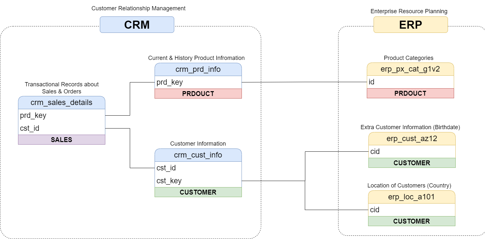

# 📊 Corporate Sales Data Warehouse (SQL Server)
## End-to-End Analytics Platform Architecture (Medallion & Star Schema)

[](https://www.microsoft.com/en-us/sql-server/)
[-blue.svg?style=flat-square)](https://learn.microsoft.com/en-us/azure/databricks/lakehouse/medallion)
[](https://en.wikipedia.org/wiki/Star_schema)
[](https://learn.microsoft.com/en-us/sql/t-sql/language-reference)

An enterprise-grade, modern Data Warehouse (DWH) platform built natively on **Microsoft SQL Server**, implementing a structured **Medallion Architecture** to ingest, process, clean, and model complex corporate sales data. 

This platform acts as a centralized "Single Source of Truth," consolidating disparate transactional and source systems into a unified, high-performance **Dimensional Star Schema** optimized for executive Business Intelligence (BI), automated reporting, and strategic data-driven decision-making.

---

## 🏗️ 1. High-Level Enterprise System Architecture

The platform processes data sequentially through three structural validation and optimization zones (Bronze $\rightarrow$ Silver $\rightarrow$ Gold). This separation decouples storage systems from high-intensity computing workloads, mitigating resource contention on online transactional systems and providing complete data immutability.

Below is the complete architectural layout mapped out from ingestion nodes to consumption schemas:


---

## 🔄 2. Data Flow & End-to-End Data Lineage

The orchestration of historical and transactional pipelines follows a strict, unidirectional lineage map. Every record contains ingestion metadata columns allowing full auditability, tracing data steps backwards from final BI dashboards directly to the originating source database logs.


### 🥉 The Bronze Layer (Raw Storage Zone)
* **Strategic Role:** Acts as an ingestion landing zone. Data is structurally identical to the raw source data pipelines without any alterations, index drops, or transformations.
* **Engineering Purpose:** Maximizes historical traceability, isolates production systems from operational degradation during extractions, and serves as an immutable point-in-time recovery source for debugging pipeline failures.

### 🥈 The Silver Layer (Enrichment & Operational Zone)
* **Strategic Role:** Cleans, normalizes, and prepares data records into structurally valid corporate entities.
* **Engineering Operations Implemented:**
  * **Data Cleaning:** Stripping whitespace, filtering corrupt payloads, and mapping default constraints to historical null entries.
  * **Standardization:** Conforming disparate date encodings (ISO 8601), standardization of address fields, and casting accurate system data types.
  * **Derived Columns:** Calculating structural temporal states, transactional net flags, and runtime transaction IDs.
  * **Data Enrichment:** Injecting foreign code descriptive fields and system-wide categorical master data lookups.

### 🥇 The Gold Layer (Analytical & Consumption Zone)
* **Strategic Role:** Exposes optimized structural metrics ready for public presentation, automated ingestion interfaces, and executive querying.
* **Engineering Purpose:** Implements custom analytical optimizations, pre-computed summary metrics, and structured relational constraints allowing minimal execution latency for analytics software.

---

## 🗄️ 3. Integration Model & Relational Topography

The internal relational model across staging areas manages the relational integrity of operational records, facilitating predictable processing paths during high-throughput parallel transactions.



---

## 📐 4. Analytical Gold Data Model (Star Schema)

The consumption tier implements a highly performant **Dimensional Star Schema Model**. This architecture isolates transactional quantitative measurements into a central, heavily indexed Fact table, surrounded by descriptive, flat Dimension tables to optimize performance during complex analytical filtering.


### 📊 Fact Table Design
* **`fact_sales`**: Houses immutable sales metrics, granular transactional values, financial figures, and physical quantities.

### 👥 Dimension Table Topography
* **`dim_customers`**: Consolidates customer profiles, demographics, historical tier classification, and master record variables.
* **`dim_products`**: Houses items inventory profiles, product categories, historical costs, and manufacturing descriptive metrics.
  
---

## 🚀 5. Implementation Stack & Technical Execution

* **Storage Engine:** Microsoft SQL Server (Relational Engine, Optimized Filegroups).
* **Data Definition Language:** Structured Transact-SQL (T-SQL) and SQL scripts establishing primary/foreign keys, clustered Columnstore indexes for large analytical metrics, and non-clustered indexes on dimensional foreign constraints.

---

## 📁 6. Local Workspace Setup Guidelines

To provision this ecosystem inside a local runtime environment, clone the version control repository and run the setup scripts sequentially:

```bash
# 1. Clone the version control repository locally
git clone https://github.com/abdoulrahmanebande/data-warehouse-project-with-sql-server.git
cd your-repository-name
```

---

## 👤 About Me

Hello! I'm **Bande Abdoul-Rahmane**, a professional **Data Scientist** and **Data Engineer** and **Data Analyst** passionate about bridging the gap between raw data infrastructure, predictive modeling, and scalable MLOps deployment cycles. 

I specialize in building complete data ecosystems—from designing high-performance relational architectures using the Medallion framework to training and serving predictive machine learning models in automated production pipelines.

### 🎓 Academic & Technical Foundation
* **B-Tech in Computer Science & Engineering** (Specialization in Data Science) | CGPA: 7.56/10
* **Core Competencies:** Data Warehousing (SQL Server, T-SQL), Data Pipeline Architectures (Medallion System, ETL/ELT), Relational & NoSQL Modeling (Star Schema, MongoDB), Advanced Machine Learning Pipelines (Scikit-Learn, XGBoost), Cross-Platform Application Analytics (Flutter & Dart), and MLOps Infrastructure (Docker, Cloud Systems).

### 🛠️ My Engineering Philosophy
I believe that machine learning algorithms are only as good as the infrastructure supporting them. Whether I am writing optimized SQL scripts to build a data warehouse or writing a script to automate batch inferencing, my goal is always to build clean, maintainable, and decoupled systems that drive real corporate value.

---

## 🏎️ The Enterprise Analytical Roadmap

This Data Warehouse serves as the foundational core for downstream analytics. To see how this schema is utilized in real-world business scenarios, follow the end-to-end lineage path:

1. **[Phase 1: Exploratory Data Analysis (EDA) using SQL](https://github.com/abdoulrahmanebande/Exploratory-Data-Analysis-with-SQL.git)** — Interrogating the Gold Schema to profile metrics, audit data health, and establish statistical scale magnitudes.
2. **[Phase 2: Advanced Analytics & Engineering using T-SQL](https://github.com/abdoulrahmanebande/Advanced-Data-Analytics-using-SQL.git)** — Building production-ready database `VIEW` layers calculating rolling metrics, part-to-whole segmentations, and behavioral profiling for BI integration.

